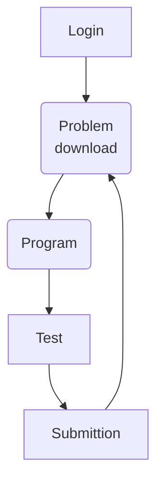

# go-atcoder
goでAtcoderの環境を作成、テスト、提出するリポジトリ

## Usage

### Environment

launch
```bash
$ make start
```

stop
```bash
$ make stop
```

enter container
```bash
$ make exec
```

### Development

#### flow


in Container

#### login
```bash
$ acc login
$ oj login https://beta.atcoder.jp/
```

#### problem download

```bash
$ cd problem
$ acc new abc001 #problem string
$ cd abc001/a
$ addgo         #template copy
```

#### program
```bash
$ vi main.go
```

#### test 
```bash
$ ojgo
```

#### submission
```bash
acc submit main.go
```